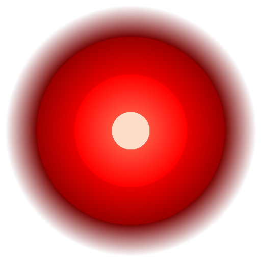

# F1 Tracker

A polished F1 data dashboard built as a macOS desktop app with Electron, React, and Vite.



## Features

- **Live Timing** — Real-time driver positions, sector times, tire compounds, DRS, intervals, team radio, and race control messages with a live GPS track map
- **Race Replay** — Full session replay with animated car positions, leaderboard, weather panel, driver telemetry panels, and playback speed control (0.5×–32×)
- **Telemetry** — Speed traces, throttle/brake/DRS/gear overlays, and speed-colored lap track maps per driver per lap
- **Calendar** — Full race calendar with session schedules, countdown timers, circuit mini-maps, and race winners
- **Results** — Race results with podiums, fastest laps, and circuit mini-maps for all completed rounds
- **Standings** — Driver and Constructor championship standings with points trends
- **Drivers** — Driver profiles with career stats, race/qualifying position charts, and headshot photos
- **Teams** — Constructor profiles and team comparisons
- **Watchlist** — Pin drivers to track across sessions
- **Dark / Light mode**

## Tech Stack

| Layer | Technology |
|---|---|
| Desktop shell | [Electron 31](https://www.electronjs.org/) |
| UI framework | [React 18](https://react.dev/) |
| Build tool | [Vite 5](https://vitejs.dev/) via [electron-vite](https://electron-vite.org/) |
| Charts | [Recharts](https://recharts.org/) |
| Date handling | [Day.js](https://day.js.org/) |
| Track maps | HTML5 Canvas 2D |
| HTTP | [Axios](https://axios-http.com/) |

## Data Sources

| Source | What it powers |
|---|---|
| [OpenF1 API](https://openf1.org/) | Live timing, car telemetry, GPS locations, driver metadata & headshots, stints, pit stops, race control, weather — all real-time and historical |
| [Jolpica / Ergast API](https://jolpi.ca/) | Historical race results, championship standings, driver & constructor records |
| [Sportstimes F1 Calendar](https://github.com/sportstimes/f1) | Race calendar data with session start times for all rounds |

## Installation

```bash
# Clone the repo
git clone https://github.com/mukunthanurradhavenkat/f1-tracker.git
cd f1-tracker

# Install dependencies
npm install

# Run in development
npm run dev

# Build for production (macOS)
npm run dist:mac
```

Requires Node.js 18+ and macOS (for the packaged `.dmg`; the dev server runs on any platform).

## Project Structure

```
src/
├── main/           # Electron main process (IPC, caching, API bridge)
├── preload/        # Context bridge (exposes window.api to renderer)
└── renderer/
    └── src/
        ├── components/   # Shared UI (TrackCanvas, CustomSelect, DriverAvatar, …)
        ├── constants/    # Endpoints, team colors, circuit outlines
        ├── context/      # React context (Watchlist, Notifications)
        ├── hooks/        # Custom hooks (useApiData, useDriverPhotos, useLiveSession, …)
        ├── tabs/         # One file per tab (LiveTiming, RaceReplay, Telemetry, …)
        └── utils/        # Lap time formatting, session detection
```

## API Architecture

All API calls go through the Electron main process via IPC (`window.api.fetch` / `window.api.fetchLarge`). The main process applies a TTL-based cache so the renderer never makes direct HTTP requests — this avoids CORS issues and keeps network logic centralized.

## License

MIT
